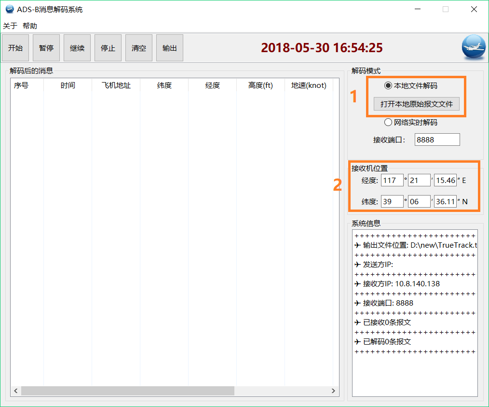

# S模式ADS-B报文解码器

### 开发环境

* *JDK:* SE1.8
* *界面制作工具:* SWT

### 源文件结构

    src--|
         |--ui--|
         |      |--UI.java
         |
         |--util--|
         |        |--DegreeDigital.java
         |        |--HexBinOct.java
         |
         |--decodeBus--|
         |             |--FileDecodeRunnable.java
         |             |--NetDecodeRunnable.java
         |             |--PreprocessFrame.java
         |             |--ProcessFrame.java
         |
         |--aircraftInfos--|
         |                 |--AdsbMes.java
         |                 |--AircraftType.java
         |                 |--Callsign.java
         |                 |--PositionAirborne.java
         |                 |--PositionRef.java
         |                 |--SpeedAir.java
         |                 |--SpeedGround.java
         |                 |--SpeedType.java
         |
         |--img--|
         |       |--icon_1.ico
         |       |--icon_2.ico
         |       |--icon_3.ico
         |       |--icon_4.ico
         |
         |--org.eclipse.wb.swt

* <font color=#4682B4 size=4 face="微软雅黑">*ui*</font>

| 源文件  | 类 | 描述        |
| ------ |----| ------------|
| UI     | UI | 图形用户界面 |

* <font color=#4682B4 size=4 face="微软雅黑">*util*</font>

| 源文件         | 类            |  描述                     |
|---------------|---------------|---------------------------|
| DegreeDigital | DegreeDigital | 数字经纬度和度分秒经纬度相互转化 |
| HexBinOct     | HexBinOct     | 十六进制转化为二进制        |

* <font color=#4682B4 size=4 face="微软雅黑">*decodeBus*</font>

| 源文件              | 类                 |  描述             |
|--------------------|--------------------|-------------------|
| FileDecodeRunnable | FileDecodeRunnable |  本地解码线程，当选择本地解码模式时，此线程开启，需首先导入本地原始报文文件，一边读文件一边解码     |
| NetDecodeRunnable  | NetDecodeRunnable  |  网络解码线程，当选择网络解码模式时，此线程开启，一边接收报文一边解码报文      |
| PreprocessFrame    | PreprocessFrame    |  对一条报文预处理，去除报文中多余字符如“*”、“;”和空格，判断这条报文是否是DF17格式的报文，并且判断报文的长度是否正确 |
| ProcessFrame       | ProcessFrame       |  对完成预处理之后的报文进行解码      |

* <font color=#4682B4 size=4 face="微软雅黑">*aircraftInfos*</font>

| 源文件              | 类                |  描述             |
|--------------------|-------------------|-------------------|
| AdsbMes            | AdsbMes           |   一条报文解码中及解码后的相关信息   |
| AircraftType       | AircraftType      |    飞行器种类    |
| Callsign           | Callsign          |   航班号         |
| PositionAirborne   | PositionAirborne  |   空中位置       |
| PositionRef        | PositionRef       |     参考位置，用于空中位置解码中的本地解码      |
| SpeedAir           | SpeedAir          |  空速           |
| SpeedGround        | SpeedGround       |  地速           |
| SpeedType          | SpeedType         |  速度子类型      |

* <font color=#4682B4 size=4 face="微软雅黑">*img*</font>

用户界面上的一些图标，系统内部资源

* <font color=#4682B4 size=4 face="微软雅黑">*org.eclipse.wb.swt*</font>

界面制作工具 SWT 的管理文件

### 使用方法

#### 本地解码

<font color=#4682B4 size=4 face="微软雅黑">**1. 选择`本地文件解码`单选框，然后填入正确的接收机位置(经纬度按度分秒来填)，并点击`打开本地原始报文文件`，会出现一个文件目录对话框**</font>

{:width="600px"}

<font color=#4682B4 size=4 face="微软雅黑">**2. 在文件目录对话框中选择需要导入的报文文件，报文文件必须是txt格式，选择好之后点击`打开`**</font>

{:width="600px"}

<font color=#4682B4 size=4 face="微软雅黑">**3. 完成上述步骤之后，点击`开始`按钮即开始解码。解码结果显示表格每500条更新一次表格，在解码过程中，点击`暂停`按钮可以实现暂停，点击`继续`继续解码进程，点击`停止`结束本次解码操作，点击`清空`以清空当前表格。所有解码结果会自动写入名为 *TrueTrack.txt* 的文件，该文件默认存储在D盘根目录下，可以在点击`暂停`或者`停止`按钮后点击`输出`按钮查看该文件，系统将使用默认的文本查看器打开 *TrueTrack.txt* 文件**</font>

{:width="600px"}

{:width="600px"}

#### 网络解码

<font color=#4682B4 size=4 face="微软雅黑">**1. 解码模式选择`网络实时解码`，并且填入接收端口，该端口必须和发送方的端口相同。并且填入正确的接收机位置(经纬度按度分秒来填)**</font>

{:width="600px"}

<font color=#4682B4 size=4 face="微软雅黑">**2. 点击`开始`按钮开始解码，解码过程中可以通过一排控制按钮控制解码进程，解释同本地解码相同。解码结果显示表格每500条更新一次。在右下方的列表中会显示发送方和本机的IP地址，并且实时更新已接收和已解码的报文的数量**</font>

{:width="600px"}

<font color=#4682B4 size=4 face="微软雅黑">**3. 点击`输出`控制按钮，可以查看全部解码结果。所有解码结果会自动写入名为 *TrueTrack.txt* 的文件，该文件默认存储在D盘根目录下，可以在点击`暂停`或者`停止`按钮后点击`输出`按钮查看该文件，系统将使用默认的文本查看器打开 *TrueTrack.txt* 文件**</font>

{:width="600px"}

### 注意事项

* 在进行网络解码时，可以连接实际ADS-B接收机接收通过网络发送的报文，必须保证二者的套接字是对应的

* 报文不能含有过多的不相关字符，最好的报文格式是不带任何其他字符的纯净报文，目前可以允 许的格式为：单条报文之前有一个`*`，单条报文后部有一个`;`，单条报文含有空格，报文与报文之间含有空行。预处理类会将带有其他字符的报文处理为纯净报文再进行解码

  可以接受的报文格式：
    ```
    *8D7804AE99C42720682883482705;
    *8D780E67994160AE6008A01E0B89;
    *8D780D545853C56B77A92D258D07;
    *9031FFDBC154CD084A58C1F03EF8;
    *8D7807C59941BC1E48109E525DF3;
    *9031FFDBC254000031F5C670C15F;
    *8D78040A200C3078CB0C605F8D01;
    *5D780C7A52110E;
    *8D896488EA40B858013F0C73CBC6;
    *5D7808AB91B67F;
    *9031FFDAC104CD084A58E66A2D9D;
    *9031FFDAC20400000BC4F7D7B5F5;
    *5D780D5FA21101;
    ```

* 如果没有ADS-B接收机，作者提供一个ADS-B报文模拟发射器，可以模拟通过网络发送报文，以模拟网络实时解码，下载地址：<https://github.com/EthanTongLIU/S_MODE_ADSB_SENDER>

* 在进行本地解码时，由于解码速度太快，如果控制栏的`暂停`，`继续`、`停止`按钮不起作用，可以多点击几次该按钮
